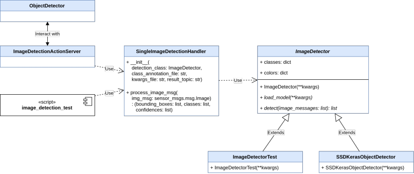

# Python Package

## Image detection architecture


## [`bounding_box.py`](../ros/src/mas_perception_libs/bounding_box.py)

### `BoundingBox`
Port of bounding box creation for point clouds from C++. Provide the following API methods:
* `get_pose`: returns `geometry_msgs/PoseStamped` of the bounding box.
* `get_ros_message`: returns `mcr_perception_msgs/BoundingBox` version of the bounding box.

### `BoundingBox2D`
Common interface in C++ and Python for rectangle regions in RGB images. Several visualization and utility methods are
built around this class.

## [`constants.py`](../ros/src/mas_perception_libs/constants.py)
Common place for all the perception related constants.

## [`image_classifier.py`](../ros/src/mas_perception_libs/image_classifier.py)

### `ImageClassifier`
Abstract class for image classification.
* An extension of this class needs to implement the following functions:
    - `classify`: receive a list of `sensor_msgs/Image` as argument, returns a list of corresponding classes.
* Any extension of this class can be used by the `RecognizeImageService` class for classifying images.

### `ImageClassifierTest`
An example implementation of `ImageClassifier` which return random classes for each image message.
Used by `mdr_perceive_plane_action` for testing.

### `KerasImageClassifier`
An implementation of  `ImageClassifier` which uses the Keras framework to classify images.

## [`image_detector.py`](../ros/src/mas_perception_libs/image_detector.py)

### `ImageDetectorBase`
Abstract class for detecting things in images.
* Any extension needs to implement methods:
    - `load_model`: load detection model using keyword arguments given to the constructor. These arguments are specified
    in the `model_kwargs_file` passed into the class constructor. An example of this file is
    [`image_detector_test_kwargs.yml`](../models/image_detector_test_kwargs.yml).
    - `_detect`: perform detection on a list of `sensor_msgs/Image` objects using the detection model.
* Extension of this class can be used with `SingleImageDetectionHandler`, which is used in `ImageDetectionActionServer`
and the test script [`image_detection_test`](../ros/scripts/image_detection_test) for detecting in images.

### `ImageDetectorTest`
Simple detection model which generates random bounding boxes and is meant to be an usage example for `ImageDetectorBase`
together with [`class_annotation_example.yml`](../models/class_annotation_example.yml) and
[`image_detector_test_kwargs.yml`](../models/image_detector_test_kwargs.yml).

### `SingleImageDetectionHandler`
Used by `SceneDetectionActionServer` and in [`image_detection_test`](../ros/scripts/image_detection_test) to detect
objects in a single image message at a time and publish detection results on a desired topic.

## [`image_recognition_service.py`](../ros/src/mas_perception_libs/image_recognition_service.py)

### `RecognizeImageService`
A wrapper for a [`ImageRecognition`](../../mcr_perception_msgs/srv/ImageRecognition.srv) service which uses
`ImageClassifier` instances to classify images.

### `ImageRecognitionServiceProxy`
Interact with an [`ImageRecognition`](../../mcr_perception_msgs/srv/ImageRecognition.srv) service to get image
classification results. An example can be found in the script
[`image_recognition_server`](../ros/scripts/image_recognition_server), which uses the `RecognizeImageService` class
above.

## [`object_detector.py`](../ros/src/mas_perception_libs/object_detector.py)

### `ObjectDetector`
* Interact with a [`DetectScene`](../../mcr_perception_msgs/action/DetectScene.action) action server to get a list of
planes containing objects.
* Perform common preprocessing steps on the objects (i.e. create bounding box, transform to desired frame,...).
* Detection action is triggered by method `start_detect_objects`. A callback param can be passed in to be executed at
  the end of the method.
* The list of planes and objects can be accessed through property `plane_list`.
* An example usage is written in the `DetectObjects` state, defined in file `action_states.py` of the
  `mdr_perceive_plane_action` package.

## [`ros_message_serialization.py`](../ros/src/mas_perception_libs/ros_message_serialization.py)
Serialize and deserialize ROS messages for interaction with C++ code.

## [`scene_detection_action.py`](../ros/src/mas_perception_libs/scene_detection_action.py)

### `SceneDetectionActionServer`
An abstract class which creates an `actionlib.SimpleActionServer` object to handle object detection action goals using
action specifications in
[`mcr_perception_msgs/DetectScene.action`](../../mcr_perception_msgs/action/DetectScene.action). An extension of this
class needs to implement:
* `_initialize`: initialization procedures before starting the action servers (i.e. loading models).
* `_execute_cb`: perform object detection and respond to the action client.

### `ImageDetectionActionServer`
An extension of `SceneDetectionActionServer` which uses `SingleImageDetectionHandler` and `ImageDetectorBase` for detecting
from an image extracted from a `sensor_msgs/PointCloud2` message, while also fitting planes in the clouds.

## [`utils.py`](../ros/src/mas_perception_libs/utils.py)
* `get_classes_in_data_dir`: Returns a list of strings as class names for a directory. This directory structure
```
data
├── class_1
└── class_2
```
should returns
```
['class_1', 'class_2']
```
when called on `data`.
* `process_image_message`: Converts `sensor_msgs/Image` to CV image, then resizes and/or runs a preprocessing function
if specified.
* `case_insensitive_glob`: `glob` files ignoring case.
* `cloud_msg_to_cv_image`: extract a CV image as a `ndarray` object from a `sensor_msgs/PointCloud2` message.
* `cloud_msg_to_image_msg`: extract a `sensor_msgs/Image` message from a `sensor_msgs/PointCloud2` message.
* `crop_organized_cloud_msg`: use a `BoundingBox2D` object to crop a `sensor_msgs/PointCloud2` message.
* `crop_cloud_to_xyz`: use a `BoundingBox2D` object to extract an array of `(x, y, z)` coordinates from a
`sensor_msgs/PointCloud2` message.
* `transform_point_cloud`: transform a `sensor_msgs/PointCloud2` cloud using a transformation matrix, calling the PCL
function in C++ code.
* `PlaneSegmenter`: Python wrapper of C++ class `PlaneSegmenterROS` (see [C++ documentation](cpp_library.md)) for
fitting planes in `sensor_msgs/PointCloud2` messages.

## [`visualization.py`](../ros/src/mas_perception_libs/visualization.py)

* `draw_labeled_boxes`: draw boxes on a CV image (`ndarray`) using `BoundingBox2D` objects.
* `draw_labeled_boxes_img_msg`: same with above but for `sensor_msgs/Image` messages.
* `fit_box_to_image`: adjust a `BoundingBox2D` object to fit an image size.
* `crop_image`: crop a CV image (`ndarray`) using a `BoundingBox2D` object.
* `bgr_dict_from_classes`: generate colors from a list of class names.

## Example usage
```Python
import numpy as np
from sensor_msgs.msg import PointCloud2
from mas_perception_libs.utils import cloud_msg_to_cv_image
from mas_perception_libs import BoundingBox2D

### An example of extracting (x, y, z) coordinates from a PointCloud2 message and estimate pose
cloud_msg = PointCloud2()       # example cloud message

# extract CV image
cv_image = cloud_msg_to_image_msg(cloud_msg)

# detect regions in image to get a bounding box
def favorite_detect_func(cv_image):
    return BoundingBox2D(box_geometry=(10, 15, 20, 30))     # (x, y, width, height)

box = favorite_detect_func(cv_image)

# crop cloud for coordinates and estimate pose
cropped_coord = crop_cloud_to_xyz(cloud_msg, box)
mean_pose = np.nanmean(np.reshape(cropped_coord, (-1, 3)), axis=0)
```
